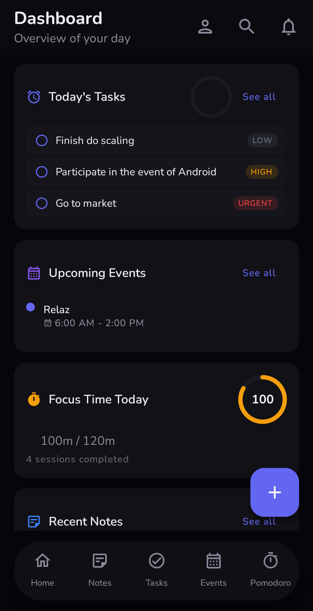
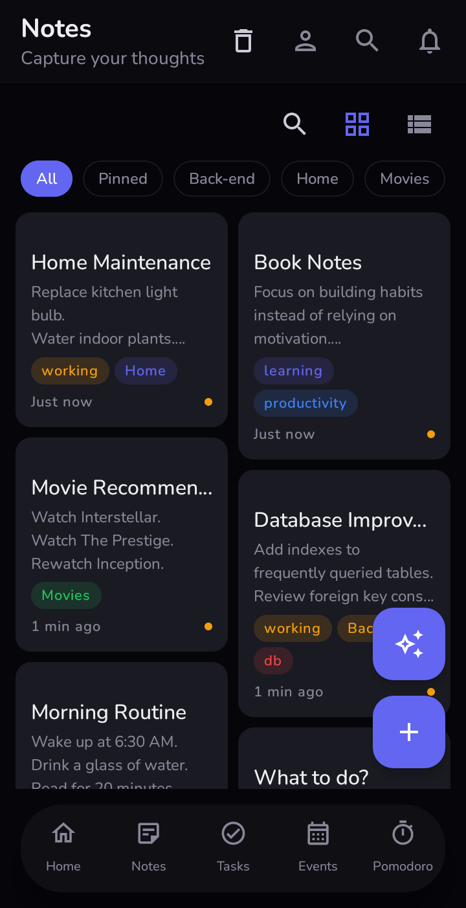
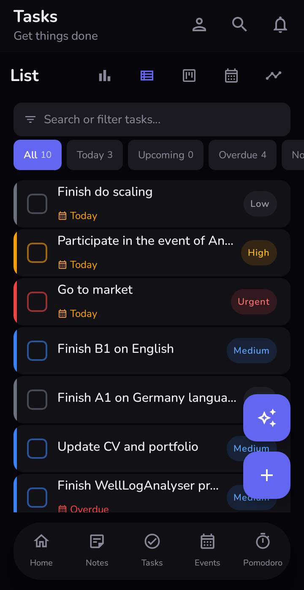
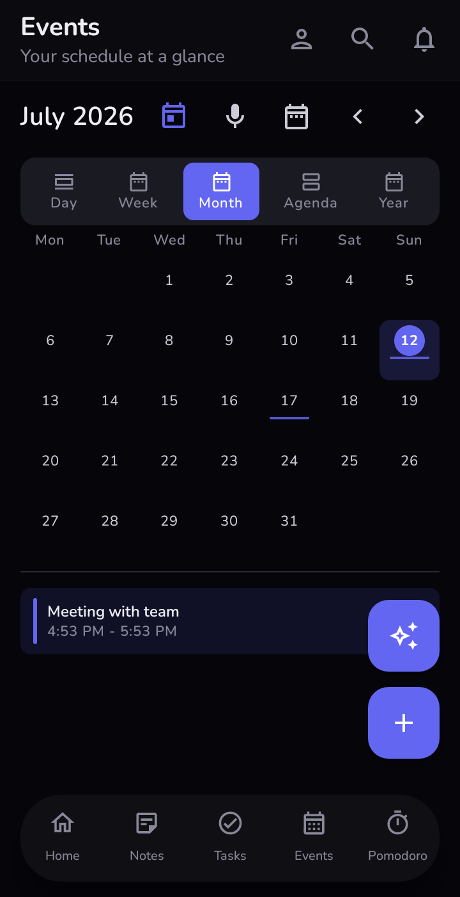
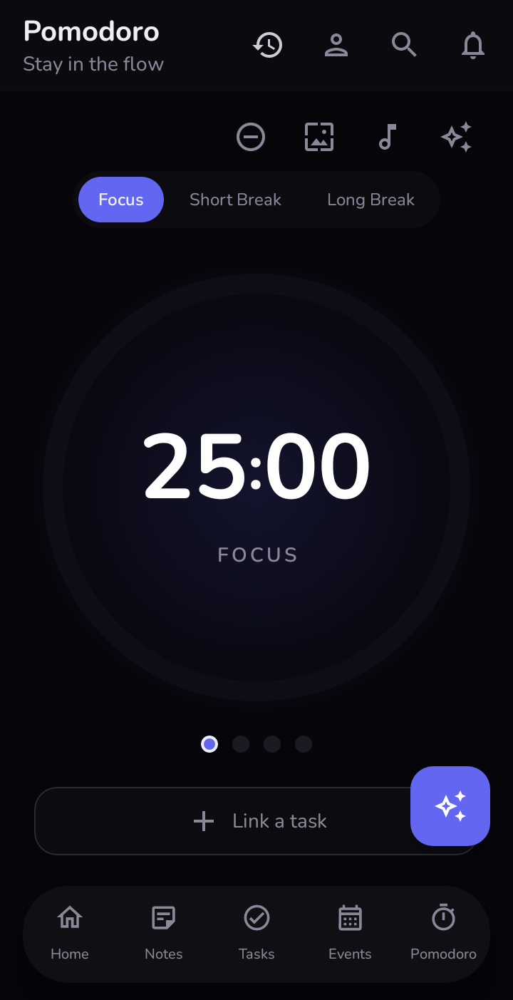
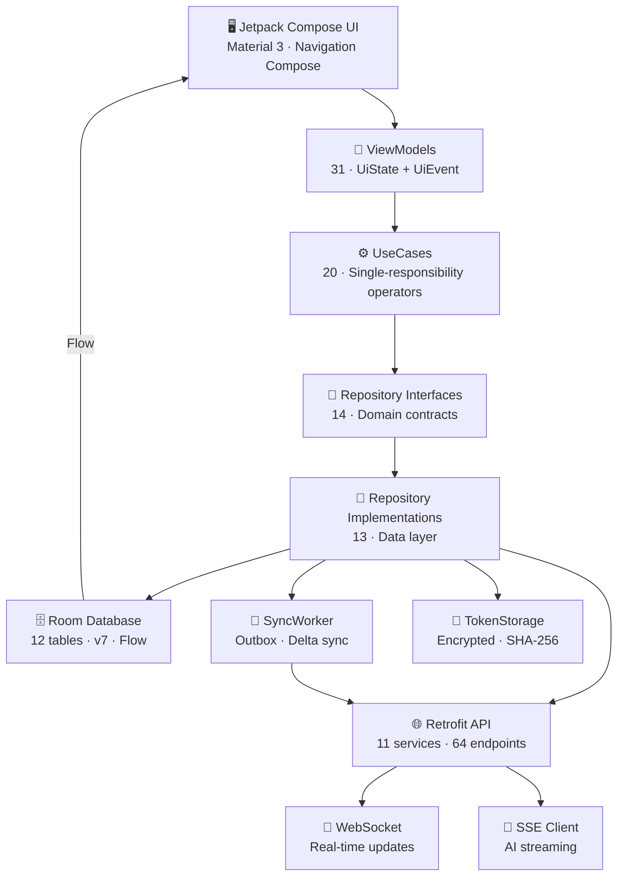
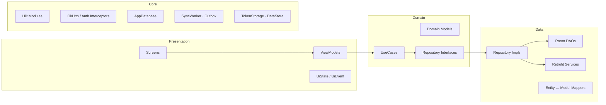
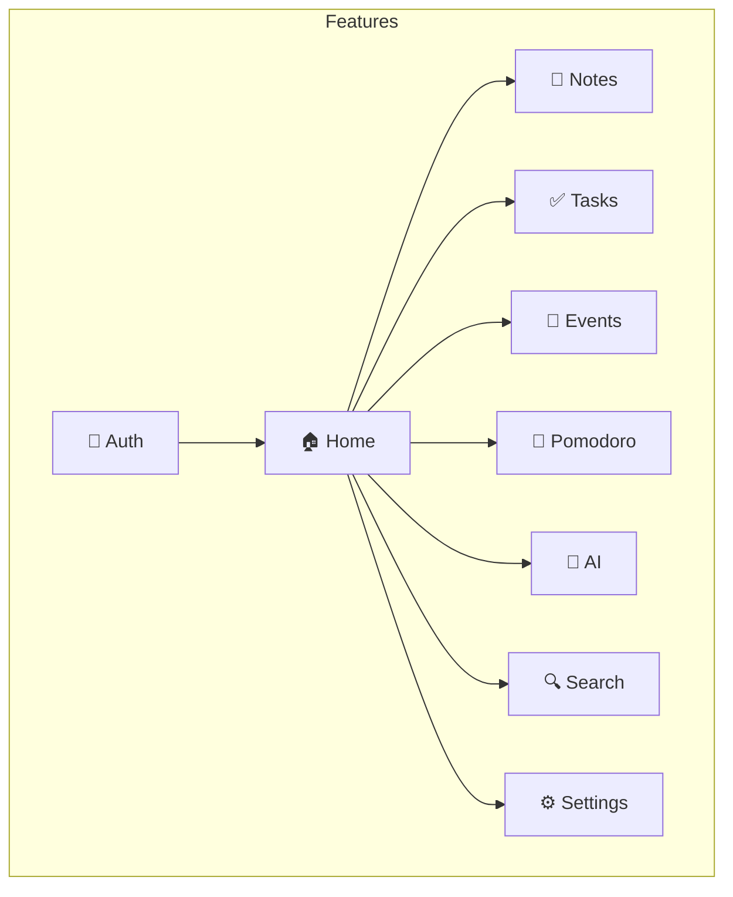
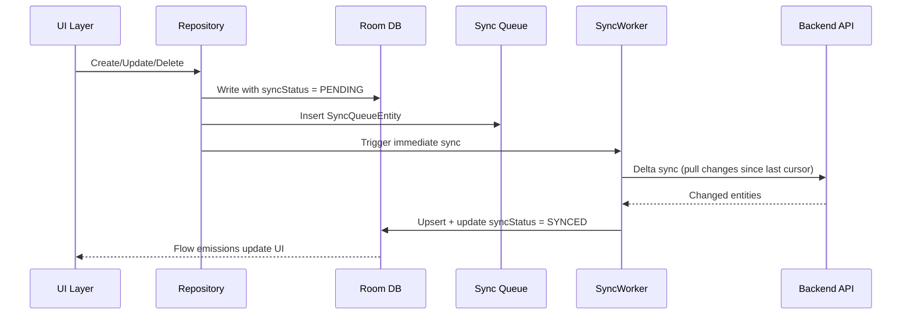

<div align="center">


# ProductivityX for Android

**Production-grade offline-first productivity ecosystem**

[](https://kotlinlang.org)
[](https://developer.android.com/jetpack/compose)
[](https://developer.android.com/about/versions/nougat-android-70)
[](LICENSE)
[](https://github.com/productivityx-app/productivityx_backend)

[Report Bug](https://github.com/productivityx-app/productivityx_android/issues) · [Download APK](https://github.com/productivityx-app/productivityx_android/releases) · [Web App](https://productivityx.vercel.app)

</div>

---

## Overview

ProductivityX Android is the native mobile client for the ProductivityX productivity ecosystem. Built entirely with **Jetpack Compose** and **Clean Architecture**, it delivers a fully offline-first experience where the local Room database serves as the single source of truth. Every write operation queues changes in an outbox pattern, and a WorkManager-powered sync engine pushes them to the server when connectivity is available.

This is not a CRUD wrapper. It's a complete productivity suite — notes with a rich text editor and PDF export, tasks with kanban boards and subtasks, a calendar with recurring events, a Pomodoro timer with foreground service persistence, AI conversations with SSE streaming, and a unified search engine across all features.

---

## Demo

<div align="center">

[](https://youtu.be/MkjT6QjkL_U)

</div>

<div align="center">

[](https://youtu.be/MkjT6QjkL_U)

</div>

---

## Screenshot Gallery

<table>
  <tr>
    <td align="center"><br/><b>Dashboard</b></td>
    <td align="center"><br/><b>Notes</b></td>
    <td align="center"><br/><b>Rich Text Editor</b></td>
  </tr>
  <tr>
    <td align="center"><br/><b>Tasks</b></td>
    <td align="center"><br/><b>Task Management</b></td>
    <td align="center"><br/><b>Calendar Events</b></td>
  </tr>
  <tr>
    <td align="center"><br/><b>Create Event</b></td>
    <td align="center"><br/><b>Pomodoro Timer</b></td>
    <td align="center"><br/><b>Session Complete</b></td>
  </tr>
  <tr>
    <td align="center"><br/><b>Session History</b></td>
    <td align="center"><br/><b>Profile & Settings</b></td>
  </tr>
</table>

---

## Features

- [x] **Notes** — Rich text editor, Markdown rendering, PDF generation, pin/unpin, folders, tags, templates, trash & restore
- [x] **Tasks** — Kanban board, subtasks, priorities, due dates, drag reorder, statistics, trash & restore
- [x] **Calendar** — Month/week/day views, recurring events (RRULE), all-day events, reminders, color coding
- [x] **Pomodoro Timer** — Foreground service, configurable durations, ambient sounds, focus mode, session history & stats
- [x] **AI Assistant** — SSE streaming conversations, multiple conversations, action blocks (create task/note/event)
- [x] **Unified Search** — Full-text search across notes, tasks, and events
- [x] **Offline-First Sync** — Delta sync, outbox pattern, conflict resolution, WorkManager background sync
- [x] **Authentication** — Register, login, email verification (OTP + magic link), forgot/reset password, token refresh
- [x] **Profile & Settings** — Edit profile, avatar upload, preferences sync, app theme, notifications
- [x] **Multi-Language** — 19 languages including RTL support
- [x] **Home Widgets** — Task list, Pomodoro timer, Quick note widgets
- [x] **Quick Settings Tiles** — Timer toggle, Quick note, Focus mode tiles
- [x] **Voice Commands** — Speech recognition for hands-free interaction
- [x] **Deep Linking** — Email verification and password reset via deep links

---

## Engineering Highlights

| Capability | Implementation |
|---|---|
| **Offline-first architecture** | Room DB as single source of truth. Every write queues to `sync_queue` table. WorkManager `SyncWorker` drains the outbox on network availability with delta sync. |
| **Conflict resolution** | Dual version system: business `version` field for client conflict detection + server-side `updatedAt` last-write-wins via `ConflictResolver`. |
| **Silent token refresh** | OkHttp `TokenRefreshInterceptor` catches 401, calls `/auth/refresh` synchronously, updates encrypted `TokenStorage`, retries the original request — transparent to all call sites. |
| **Foreground service timer** | `PomodoroForegroundService` manages timer state as `StateFlow<TimerState>`. UI binds via `ServiceConnection`. Persistent notification with Play/Pause/Skip actions. |
| **SSE streaming** | OkHttp `EventSource` collects AI tokens into `StateFlow<String>`. Chat UI re-renders incrementally as each token arrives. |
| **PDF generation** | Custom `PdfEngine` with `PdfBlockRenderer`, `PdfInlineRenderer`, `PdfTableRenderer`, `PdfImageHandler`. Full Markdown-to-PDF rendering pipeline. |
| **WebSocket real-time** | `WebSocketManager` subscribes to `/topic/notes`, `/topic/tasks`, `/topic/events` for server-pushed updates. |
| **Encrypted storage** | `SecurityCrypto` EncryptedSharedPreferences for token storage. SHA-256 hashed tokens in transit. |
| **Modular DI** | 15 Hilt modules — 7 core (Network, Database, Storage, Worker, WebSocket, Sync, Alarm) + 8 feature-specific. |

---

## Project Statistics

<table>
  <tr>
    <td align="center"><b>~78,700</b><br/>Lines of Code</td>
    <td align="center"><b>359</b><br/>Kotlin Files</td>
    <td align="center"><b>31</b><br/>ViewModels</td>
    <td align="center"><b>27</b><br/>Repositories</td>
  </tr>
  <tr>
    <td align="center"><b>20</b><br/>UseCases</td>
    <td align="center"><b>12</b><br/>DB Entities</td>
    <td align="center"><b>36+</b><br/>Compose Screens</td>
    <td align="center"><b>64</b><br/>API Endpoints</td>
  </tr>
  <tr>
    <td align="center"><b>50+</b><br/>Nav Routes</td>
    <td align="center"><b>19</b><br/>Languages</td>
    <td align="center"><b>15</b><br/>Hilt Modules</td>
    <td align="center"><b>12</b><br/>DB Tables</td>
  </tr>
</table>

| Metric | Value |
|---|---|
| **Total Kotlin files** | 359 (0 Java) |
| **Lines of code (Kotlin + XML)** | +50K |
| **Activities** | 2 (`MainActivity`, `VoiceCommandActivity`) |
| **Fragments** | 0 (100% Compose) |
| **ViewModels** | 31 |
| **Repository interfaces** | 14 |
| **Repository implementations** | 13 |
| **UseCase classes** | 20 |
| **Room entities** | 12 (12 tables) |
| **DAO interfaces** | 10 |
| **Compose screens** | 36+ |
| **Navigation routes** | 50+ |
| **Hilt DI modules** | 15 |
| **Foreground services** | 1 (`PomodoroForegroundService`) |
| **Tile services** | 3 (Timer, Quick Note, Focus Mode) |
| **Home screen widgets** | 3 (Task List, Pomodoro, Quick Note) |
| **Workers** | 1 (`SyncWorker`) |
| **API endpoints consumed** | 64 |
| **WebSocket topics** | 4 (`/ws`, notes, tasks, events) |
| **Supported languages** | 19 |
| **Database migrations** | 3 (v3 → v4 → v5 → v6, DB at v7) |

---

## Architecture



### Clean Architecture Layers



### Feature Modules



---

## Technology Stack

| Layer | Technology | Version |
|---|---|---|
| **Language** | Kotlin | 2.0.21 |
| **UI** | Jetpack Compose + Material 3 | BOM 2024.12.01 |
| **Navigation** | Navigation Compose | 2.8.5 |
| **DI** | Hilt (Dagger) | 2.52 |
| **Networking** | Retrofit + OkHttp | 2.11.0 / 4.12.0 |
| **Database** | Room | 2.6.1 |
| **Background** | WorkManager | 2.10.0 |
| **Images** | Coil 3 | 3.0.4 |
| **Storage** | DataStore + Security Crypto | 1.1.1 / 1.1.0-alpha06 |
| **Markdown** | Compose Markdown Renderer | 0.31.0 |
| **Serialization** | Kotlinx Serialization | 1.7.3 |
| **Lifecycle** | ViewModel Compose + Runtime | 2.8.7 |
| **Build** | AGP + KSP | 8.7.3 / 2.0.21-1.0.28 |
| **Min SDK** | Android 7.0 (API 24) | — |
| **Target SDK** | Android 15 (API 35) | — |
| **Compile SDK** | API 36 | — |
| **JVM Target** | 17 | — |

---

## Folder Structure

```
app/src/main/java/com/oussama_chatri/productivityx/
├── MainActivity.kt
├── ProductivityXApp.kt
│
├── core/                              # Shared infrastructure
│   ├── alarm/                         # AlarmScheduler, BootReceiver
│   ├── data/                          # DataExportImport, Encryption
│   ├── db/                            # AppDatabase, Converters, Migrations
│   ├── di/                            # Hilt modules (Network, Database, Storage, ...)
│   ├── enums/                         # Shared enumerations
│   ├── network/                       # Interceptors, NetworkMonitor, SyncGuard
│   ├── notifications/                 # NotificationHelper, Channels
│   ├── storage/                       # TokenStorage, PreferencesDataStore
│   ├── sync/                          # SyncWorker, OutboxProcessor, DeltaSyncManager
│   ├── ui/                            # Theme, Components, Navigation, Widgets, Voice
│   ├── util/                          # Extensions, DateTimeUtils, Resource
│   └── websocket/                     # WebSocketManager
│
└── features/                          # Feature modules (each: data/domain/presentation)
    ├── ai/                            # AI chat · SSE streaming
    ├── auth/                          # Login, Register, Verify, Reset
    ├── events/                        # Calendar, CRUD, Recurrence
    ├── home/                          # Dashboard, Widgets
    ├── notes/                         # Rich editor, Markdown, PDF, Tags, Folders
    ├── pomodoro/                      # Timer, Foreground service, Ambient sounds
    ├── search/                        # Unified cross-feature search
    ├── settings/                      # Profile, Preferences, Password
    └── tasks/                         # Kanban, Subtasks, Statistics
```

---

## Platform Architecture

### Offline-First Synchronization



### Conflict Resolution

| Scenario | Resolution |
|---|---|
| **Same entity, different fields** | Merge — apply both changes |
| **Same field, different values** | Last-write-wins by `updatedAt` timestamp |
| **Client has PENDING, server has newer** | Server wins, local updated |
| **Unresolvable conflict** | Surfaced to user via sync status indicator |

### Database Schema

```
┌─────────────────────────────────────────────────┐
│                  productivityx.db (v7)            │
├─────────────────────────────────────────────────┤
│  notes        │ note_tags       │ tags           │
│  note_folders │ note_templates  │ note_links     │
│  tasks        │ events          │ pomodoro_*     │
│  conversations│ messages        │ sync_queue     │
└─────────────────────────────────────────────────┘
```

---

## Getting Started

### Prerequisites

- Android Studio Hedgehog (2023.1.1) or later
- JDK 17
- Android SDK 36
- Physical device or emulator (API 24+)

### Configuration

Create `local.properties` in the project root:

```properties
BASE_URL=https://your-backend-url/
WS_URL=wss://your-backend-url/ws
```

### Build & Run

```bash
# Debug build
./gradlew assembleDebug

# Release build (requires signing config)
./gradlew assembleRelease
```

Output: `app/build/outputs/apk/release/app-release.apk`

### Download

Download the latest APK from [GitHub Releases](https://github.com/productivityx-app/productivityx_android/releases).

---

## Testing

```bash
# Unit tests (JVM)
./gradlew test

# Instrumented tests (device/emulator)
./gradlew connectedAndroidTest
```

Tests use `kotlinx-coroutines-test` + MockK for ViewModels, in-memory Room for repositories, and `ComposeTestRule` for UI.

---

## Roadmap

- [ ] Push notifications with Firebase Cloud Messaging
- [ ] Biometric authentication (fingerprint/face)
- [ ] Tablet-optimized layouts
- [ ] Home screen widget improvements
- [ ] Offline AI model support
- [ ] Data export to various formats
- [ ] Recurring task support
- [ ] Task time tracking integration
- [ ] Collaborative notes (real-time co-editing)
- [ ] Wear OS companion app

---

## License

This project is licensed under the **Non-Commercial Source Available License**.

You may view, study, learn from, and modify the source code for personal, educational, research, and evaluation purposes. **Commercial use is strictly prohibited** without prior written permission.

See [LICENSE](LICENSE) for full details.

---

<div align="center">

**Built with precision by [Oussama Chatri](https://github.com/osamachatri)**

[ProductivityX](https://github.com/productivityx-app) · [Android](https://github.com/productivityx-app/productivityx_android) · [Backend](https://github.com/productivityx-app/productivityx_backend) · [Web](https://github.com/productivityx-app/productivityx_web)

</div>
